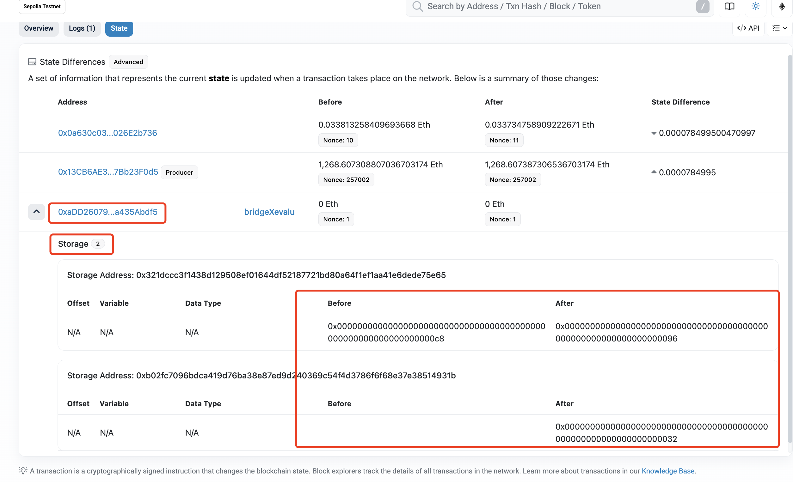

# bridgeX-evaluation
## slots statistics
We evaluate BridgeX's costs of data/token migration between L1/L2 blockchains for different businesses: ERC20, Auction, and Member, and the business code (i.e., smart contract) is in the "contracts" folder.

## BridgeX architecture & workflow
BridgeX builds on top of the Cloak stack to offer *TEE-backed* state migration between any two EVM-compatible blockchains. The minimal components you need to keep in mind are:

1. **Source/Target blockchains** – host the business contracts (ERC20, Auction, Member) and emits storage updates we want to replicate.
2. **BridgeX Service (based on Cloak Service)** – an on-chain registry plus a proxy-escrow logic that takes control of user contracts through the ERC1967 proxy pattern and forwards calls to the confidential executor.
3. **TEE node (Cloak TEE)** – executes bridgex logic inside hardware-isolated enclaves, maintains the synchronized contract state, and produces verifiable receipts. In some scenarios, the TEE nodes can also play as one of the EVM-enabled gas-free blockchains.

### High-level interaction
1. **Escrow & onboarding**: The user deploys a TransparentUpgradeableProxy that points to their logic contract. By calling `service.escrow(proxyAddr, logicAddr)` the proxy admin is swapped to BridgeX's ProxyBridge implementation so that subsequent upgrades are coordinated by the enclave.
2. **Transaction relay**: Users submit signed transactions either directly to the TEE (through the Cloak client under `client/`) or to the original chain. The Cloak Service records them and forwards execution to the enclave.
3. **State replication**: The TEE executes the contract bytecode, updates its confidential state, and (optionally) emits proofs that can be relayed to another chain. Our evaluation measures how many storage slots must be synchronized for representative business logic, because the slot count directly influences the 21,900 / 6,903 gas universal state interoperability costs.

### Repository layout (architecture alignment)
| Path | Role |
| --- | --- |
| `contracts/` | Business logic contracts that model ERC20 transfers, auctions, and membership management, deployed on the source chain before escrow. |
| `client/` | A customized Web3 SDK (`Cloak`) plus benchmarking scripts that connect to BridgeX Service and TEE through mTLS, simulating end-user submissions. |
| `service/` | Fork of Cloak Service that runs on-chain to manage escrow, proxy upgrades, and whitelist logic. Needed when you reproduce the full onboarding workflow. |
| `tee/` | Cloak TEE runtime (based on Microsoft CCF and eEVM) that actually executes escrowed contracts inside enclaves. |
| `test-data/` | Collected state-change datasets and notes that back the slot statistics; useful for reviewers who want to audit without re-running everything. |

## Evaluation scope and rationale
We selected three canonical contract categories to showcase BridgeX's applicability:

- **ERC20 token transfers** – stresses repeated balance updates and allowance bookkeeping, highlighting scenarios dominated by repeated slot rewrites.
- **Auction** – combines struct creations and bids, introducing sporadic but heavy storage growth.
- **Member registry** – models membership CRUD patterns with overlapping storage to expose duplicate slot updates.

These cover continuous transfers, bursty market actions, and identity-style data – the same trio referenced in the BridgeX paper. By quantifying slot consumption for each, reviewers can extrapolate costs for other workloads with similar storage patterns.

## Experiment workflow
To reproduce the evaluation results of BridgeX, you can follow the steps below:
1. **Deploy contracts** either locally (Ganache/anvil) or on Sepolia using the sources in `contracts/`.
2. **Escrow to BridgeX** by following the instructions in `service/README.md`: upgrade the proxy to `ProxyBridge`, call `service.escrow`, and ensure the TEE registers the contract.
3. **Generate traffic** using the scripts under `client/test` (e.g., `node client/test/index.js <cert-path> <service-addr> <baseline>`) which submit transactions via the Cloak HTTPS provider while simultaneously mirroring calls to the on-chain proxy for comparison.
4. **Compute migration cost** by observing the number of new slots and updated slots (via IDE such as Remix IDE, interfaces for slots statistics, or inherited counters of TEE runtime), combined with the corresponding universal state interoperation cost, shown in `test-data/update_state`.

> **Note**  
> Full automation (bringing up service + TEE + scripts) is not packaged yet; see `test-data/` for ready-made traces and refer to the TODO list for planned improvements (reproduction playbooks, configurable slot script, etc.).

## Demonstrated Slots Statistics
For convenience, we have completed the above steps and demonstrated the slots statistics on the testnet so that you can directly view the statistics of slots. We deployed the three contracts: ERC20, Auction, and Member on the Sepolia testnet. The contract addresses are:

- ERC20: 0xadd2607935a12814af72c06e4e5bb64a435abdf5
- Auction: 0x586660035bF89175C3b714BB64284635d417aFb2
- Member: 0x424d1c0b4134BFE5e71632BA5f72Beb17246F4a3

Then we sent transactions to involve the functions of the three contracts. The transaction hashes are as follows:

- ERC20:
  - transfer tx: 0x2329f65bd36299b3c6f42a1da89907f3ce538611f02479253c8385305354f18e
- Auction:
  - create auction tx: 0x2329f65bd36299b3c6f42a1da89907f3ce538611f02479253c8385305354f18e
  - bid tx: 0x9e24dbb445e8abeabc4ad2edb97782fbd78e3f2ec8140d29036da82038f0d075
- Member:
  - create member1 tx: 0x0ead6b471d40dff4454dd7d0e1f9a67eee8756ae2d652cfe61db48693a61c4e5
  - create member2 tx: 0x897fb2ebcc599673d00dabf765c5b7b4cb5edf012705690e6ff4ed123f9a9251

The above transactions made the corresponding contract's storage layout change, which can be observed on the etherscan explorer. For example, [the ERC20 transfer tx](https://sepolia.etherscan.io/tx/0x2329f65bd36299b3c6f42a1da89907f3ce538611f02479253c8385305354f18e#statechange) changed two slots of the ERC20 contract (whose address is 0xaDD26079...a435Abdf5)：

The slots statistics for bridgeX evaluation may involve multiple transactions, *e.g.*, the slots statistics for the ERC20 contract involve 50 transfer transactions. For convenience, we provide a Python script (*i.e.*, testnet_demo.py) to count the number of changed slots.

In addition, this repository does not provide a fully automated script that includes all experimental steps, for example, you need to manually deploy contracts and invoke functions. However, this also provides you with a certain degree of flexibility. You can freely select one or two blockchains and replace the relevant parameters in the testnet_demo.py script (including API interfaces, contract addresses, and transaction hashes) with your own. After running the script, you can obtain the test results of the blockchain you choose.
